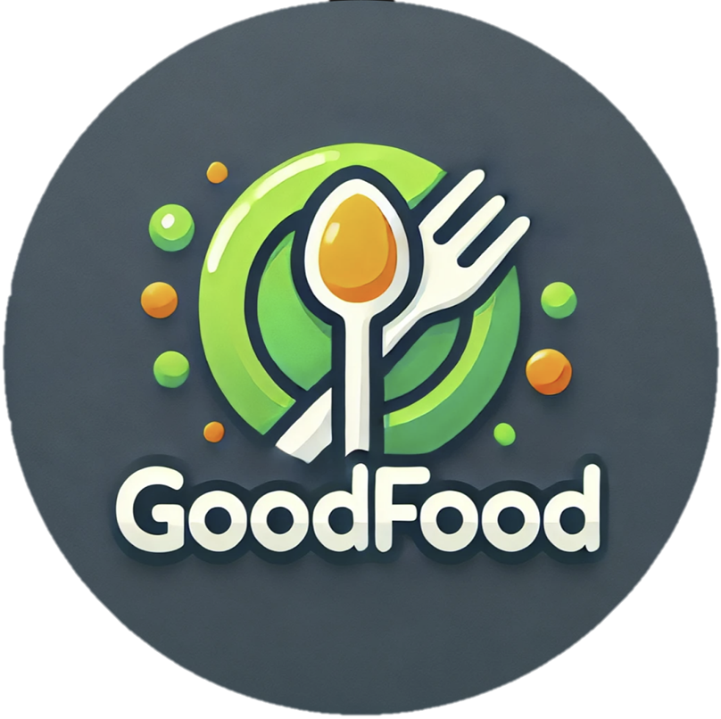

# GoodFood

A web application that allows users share and find recipes.

 

## Table of Contents
1. [Fragments](#fragments)
2. [Technologies Used](#technologies)
3. [Authors](#authors) 

## Fragments ✨
</a>
* Log In: Allows user to log in to the app.

* Sign up: Allow user to sign up to the app.

* My Recipes: Fragment that allows user to view all his posts, edit, and delete them.

* My Profile: Fragment that allows user to view his profile picture, name, and email, and to edit the profile picture and name.

* Search: Fragment that allows user to search in all posts in database.

* New Post: Allows user to upload a new recipes (picture, title, content). This fragment also serves as an edit post fragment if user navigated from "My Recipes".

* View Post: Allows user to view full post content and the user that uploaded it. Accessible from Search fragment and My Recipes fragment.

## Technologies Used 🛠️
* **Kotlin**
* **Firebase Authentication** - *for managing users sign up and log in.
* **Firebase Firestore Database** - *for managing recipes and users collections*
* **Picasso** - *for viewing pictures*
* **Imgur API** - *for uploading images*
* **ROOM Database** - *for managing local database*

## Authors 📝
* **Hanna Sofer** - *Developer*
* **Yotam Zeevi Federman** - *Developer*

